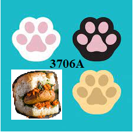
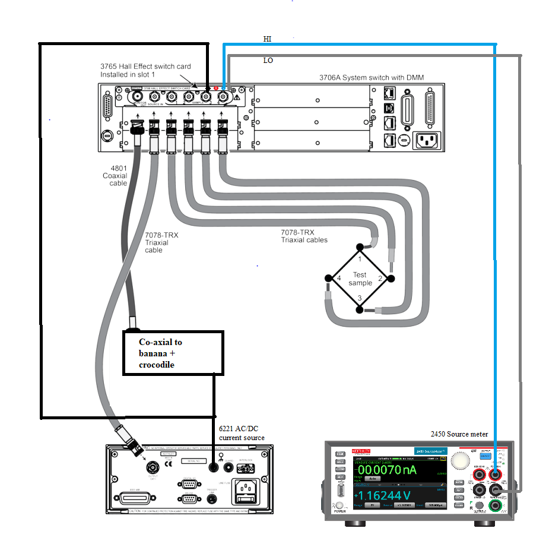
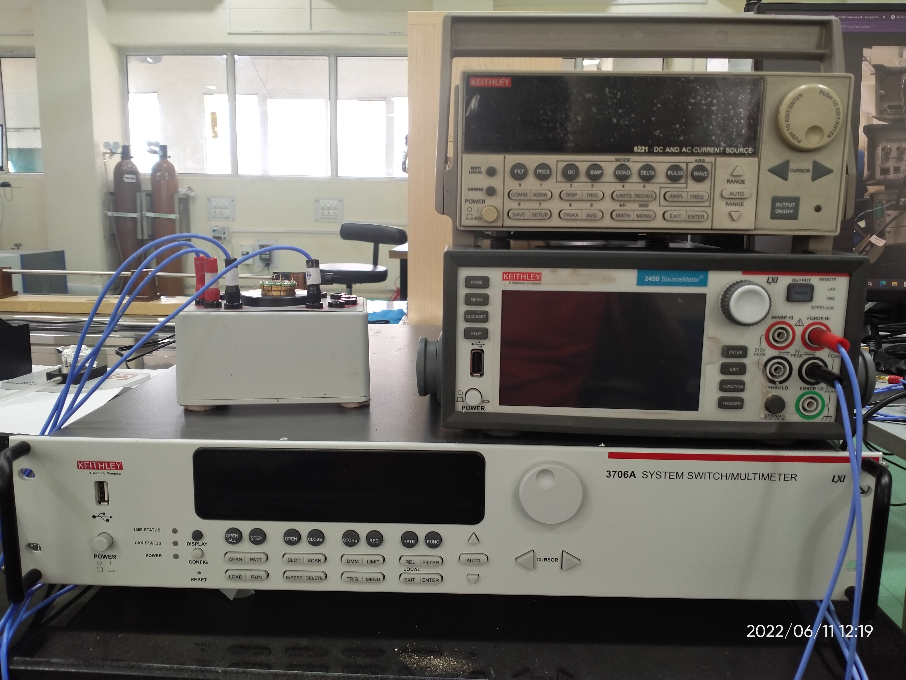
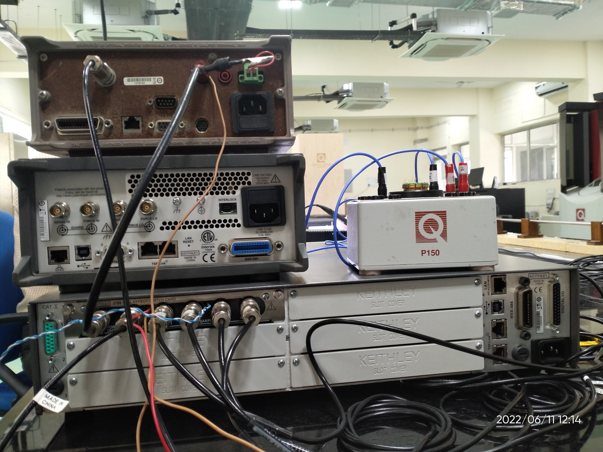

 | VanDerPaw_with_system_switch

| Van Der Paw method
| The Van der Paw method is a method for measuring the specific resistivity and Hall effect of flat samples of arbitrary shape, in which contacts are sufficiently small and placed on the circumference of the sample.
| If one is provided with just an SMU, one can achieve all the eight configurations ( V1 - V8 ) by switching the probes manually.
… 
| In this setup, we have used a system switch to internally switch the connections and achieve the eight configurations. The user just needs to execute the LabView code once, and it switches internally and generates all 8 configurations and takes the corresponding voltage readings. Additionally, this can be done for different sets of current values.

Switching mechanism:
|  The Hall effect card inside the system switch contains a matrix grid, which looks like:
.. image:: docs/mat.JPG
    :width: 100
| By closing appropriate cross-points, one can generate the various configurations. Primitively, one can do this manually on the switch, this code automates the process.

| For the automation, we connect the devices via GPIB and type-B cables to the system and install their drivers. The details are given in the manual.

| The instructions for use are given in the Manual.
| The links to the references are given below:
| https://aki.issp.u-tokyo.ac.jp/okano/WalWiki/etc/VDP_PRR_13_1.pdf
| https://download.tek.com/document/1KW-60641-1_van_der_Pauw_Resistivity_Hall_Voltage_4200A-SCS_Application_Note_092419.pdf
    
    

